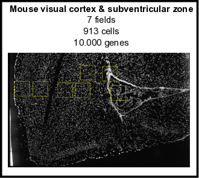
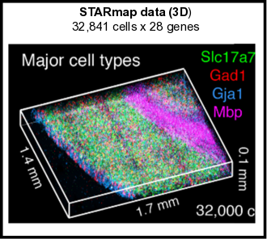
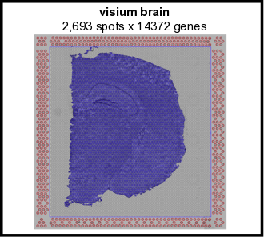
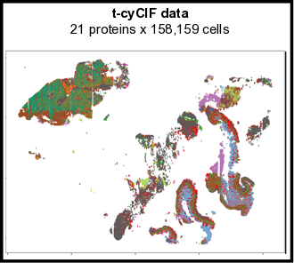
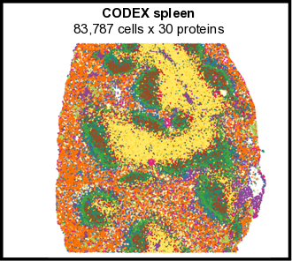

<!-- README.md is generated from README.Rmd. Please edit that file -->

<!-- This line is from RStudio -->

# Giotto

<!-- badges: start -->

<!-- badges: end -->

The Giotto package consists of two modules, Giotto Analyzer and Viewer
(see
[www.spatialgiotto.com](http://spatial.rc.fas.harvard.edu/spatialgiotto/giotto.html)),
which provide tools to process, analyze and visualize **single-cell
spatial expression** data. The underlying framework is generalizable to
virtually all currently available spatial datasets. We recently
demonstrated the general applicability on 10 different datasets created
by 9 different state-of-the-art spatial technologies, including *in
situ* hybridization (seqFISH+, merFISH, osmFISH), sequencing (Slide-seq,
Visium, STARmap) and imaging-based multiplexing/proteomics (CyCIF, MIBI,
CODEX). These technologies differ in terms of resolution (single cell vs
multiple cells), spatial dimension (2D vs 3D), molecular modality
(protein vs RNA), and throughput (number of cells and genes). More
information and documentation about the latest (developmental) version
of Giotto Analyzer can be found at <https://rubd.github.io/Giotto/>.


## Requirements

  - R (\>= 3.5.1)
  - Python (\>= 3.0)
  - Windows, MacOS, Linux

## Installation

See [FAQs](https://rubd.github.io/Giotto/articles/faqs.html) for
additional information.

#### R installation

You can install (\~1-5 mins) Giotto with:

``` r
library(remotes)  # if not installed: install.packages('remotes')
# to install the latest version
remotes::install_github("RubD/Giotto")
```

#### Python tools (optional)

This is necessary to run all available analyses, including Leiden /
Louvain clustering and to build and use the interactive visualization
tool.

We are working on building a one-line install command via bioconda
\[work in progress\].

Required python modules: pandas / igraph / networkx / leidenalg

pip installation one-liner:

``` bash
pip3 install pandas python-igraph networkx python-louvain leidenalg
```

If pip install does not work, try installing within a [conda
environment](https://docs.conda.io/projects/conda/en/latest/user-guide/tasks/manage-environments.html#creating-an-environment-with-commands):

``` bash
conda install -c anaconda pandas
conda install -c conda-forge python-igraph
conda install -c anaconda networkx
conda install -c conda-forge python-louvain
conda install -c conda-forge leidenalg
```

#### HMRF

See [**HMRF**](http://www.nature.com/articles/nbt.4260) installation
[instructions](http://spatial.rc.fas.harvard.edu/install.html).

#### Giotto Viewer

See
[link](http://spatial.rc.fas.harvard.edu/spatialgiotto/giotto.install.native.html)

 

## Examples

  - see <https://github.com/RubD/spatial-datasets> to find raw and
    pre-processed input data and Giotto scripts (in progress).
  - typical run time range for the different datasets on a personal
    computer is around 10\~45 mins.  
  - click on the image and try them out yourself.

[](./articles/mouse_seqFISH_cortex_200319.html)
[](./articles/mouse_merFISH_hypoth_preoptic_region_200326.html)
[](./articles/mouse_starmap_cortex.html)
[](./articles/mouse_visium_brain_200325.html)
[](./articles/mouse_visium_kidney_200326.html)
[](./articles/human_cycif_PDAC_200322.html)
\[\]
[](./articles/mouse_CODEX_spleen.html)

## References

  - [Dries, R. et al. Giotto, a pipeline for integrative analysis and
    visualization of single-cell spatial transcriptomic data.
    bioRxiv 701680
    (2019).](https://www.biorxiv.org/content/10.1101/701680v1)
    <doi:10.1101/701680>

  - [Eng, C.-H. L. et al. Transcriptome-scale super-resolved imaging in
    tissues by RNA seqFISH+. Nature 1
    (2019).](https://www.nature.com/articles/s41586-019-1049-y)
    <doi:10.1038/s41586-019-1049-y>

  - [Zhu, Q., Shah, S., Dries, R., Cai, L. & Yuan, G.-C. Identification
    of spatially associated subpopulations by combining scRNAseq and
    sequential fluorescence in situ hybridization data. Nature
    Biotechnology (2018).](https://www.nature.com/articles/nbt.4260)
    <doi:10.1038/nbt.4260>
